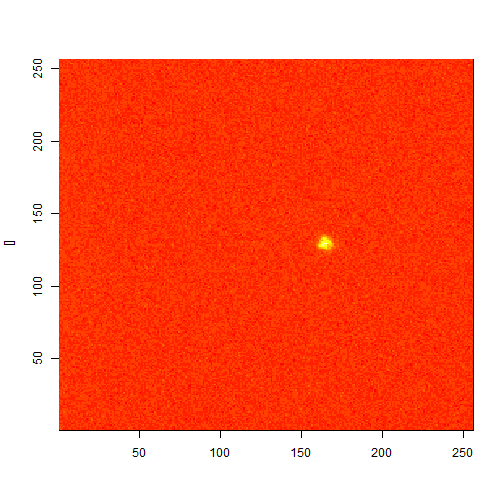

## The rise of astrostatistics
* Astrophysicists and cosmologists are turning to statisticians to help them analyze an ever-increasing deluge of data.

* Other fields had already embraced statistics. Statistics is vital to all branches of biology-especially epidemiology, medical research, and public health-and geology.

* Slowly, though, astronomers began to realize that they might be able to benefit from the expert help of a statistician.

* One of the recently formed groups is the LSST Informatics and Statistical Science collaboration, organized in preparation for the Large Synoptic Survey Telescope, which, beginning in 2022, will photograph the entire southern sky every three days for 10 years.

(Courtesy of SYMMETRY (a joint Fermilab/SLAC publication)
http://www.symmetrymagazine.org/article/november-2014/the-rise-of-astrostatistics)

--- .class #id 

## CRAN packages in R for Astronomy
The Comprehensive R Analysis Network (CRAN) is a collection of ~5000 extension packages to the public domain R statistical software system.  It has been growing exponentially since 2001.  This page is an attempt to maintain an up-to-date listing of CRAN packages written specifically for astronomy, given in order of most recently added/modified.  

* Listed alphabetically
* astro: Astronomy functions, tools and routines 
* astrodatR: Astronomical data
* astroFns: Astronomy: time and position functions, misc. utilities
* astrolibR: Astronomy Users Library

[click on URL below for the rest of the list]

(Courtesy of ASAIP - https://asaip.psu.edu/forums/software-forum/459833927)

--- .class #id 

## Example of using astronomical R code in Slidify

```r
X <- readFITS("s20140112.200.0018.fits") # read Flexible Image Transport System observation file
ax1 <- axVec(1, X$axDat); ax2 <- axVec(2, X$axDat); xlab <- X$axDat$ctype[1]
ylab <- paste(X$axDat$ctype[2], " [", X$axDat$cunit[2], "]", sep = "")
image(ax1, ax2, X$imDat, xlab = xlab, ylab = ylab)
```

 

--- .class #id 

## Recent publications

1. Introduction to Astrostatistics and R by Eric Feigelson, Penn State University

http://bccp.berkeley.edu/beach_program/COTB14Feigelson1.pdf

## Literature

1. Modern Statistical Methods for Astronomy (with R Applications), Feigelson and Babu, CambridgePress, 2012

2. Statistical Methods for Astronomical Data Analysis, Asis KumarChattopadhyay
TanukaChattopadhyay, Springer Series in Astrostatistics, 2014

3. An Introduction to Statistical Learning with Applications in R, Gareth James et al, Springer 2013


